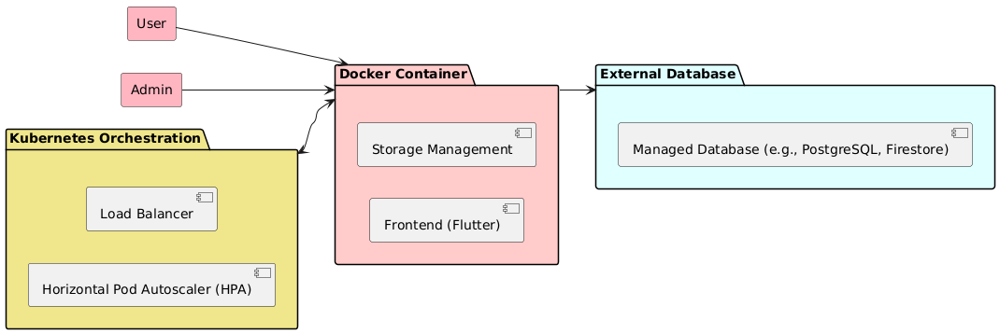
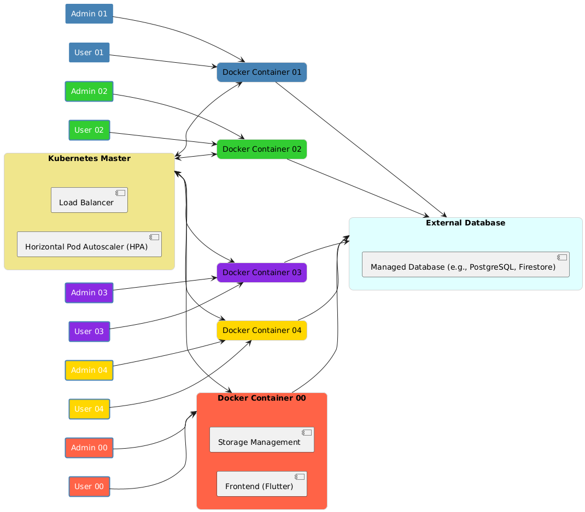

Scalable Hospital Management System

## **Overview of the System Design**

The Hospital Management System is a scalable, containerized solution deployed on Kubernetes to manage essential operations for hospitals. Each container is responsible for managing 1-2 hospitals, and the system ensures seamless scalability, fault tolerance, and efficiency.

### **Key Features**  
- **Modules**:
  - HR Management
  - Inventory Management
  - Laboratory Information System
  - Billing and Financial Management
  - Patient Records Management
- **Frontend**: Flutter (for web-based UI)
- **Storage Management**: Local caching and interaction with an external database.
- **Database**: Managed database service (e.g., Google Cloud Storage, AWS RDS, or Cloud SQL).
- **Scalability**:
  - **Auto-Scaling**: Kubernetes ensures that containers auto-scale based on traffic, using the Horizontal Pod Autoscaler (HPA) to automatically adjust the number of pods.
  - **Auto Load Balancing**: Docker automatically handles load balancing by distributing traffic across containers for optimal performance and availability.
  - External databases and cloud storage scale dynamically to manage increased load.
- **Resilience**:
  - Load balancing ensures high availability and optimized performance.
  - Fault tolerance provided by Kubernetes and managed database solutions.

---
# Containerized Application

This document explains the architecture of a containerized application for managing hospital data efficiently.

## Single Container Setup


- A single container is configured to handle data for two hospitals.  
- Data is stored in a centralized database to prevent loss, even if the container stops or restarts.  
- This setup is simple but serves as the foundation for more scalable solutions.

## Scalable Multi-Container Setup



- Multiple cloned containers are deployed to handle the workload for additional hospitals.  
- All containers are connected to a single centralized database and managed through Kubernetes.  
- This setup provides scalability, high availability, and reliability for large-scale operations.



---

## **Steps to Replicate the Architecture**

### **1. Infrastructure Setup**
1. **Cloud Provider**:
   - Use a cloud platform like Google Cloud, AWS, or Azure.
2. **Kubernetes Cluster**:
   - Create a Kubernetes cluster with at least 3 nodes.
   - Choose a machine type that supports the necessary compute and memory requirements (e.g., 4 vCPUs and 8GB RAM per node).

### **2. Dockerize the Application**
1. **Flutter Frontend**:
   - Build the Flutter web application using:
     ```bash
     flutter build web
     ```
   - Create a Dockerfile for the Flutter app:
     ```dockerfile
     FROM nginx:alpine
     COPY build/web /usr/share/nginx/html
     CMD ["nginx", "-g", "daemon off;"]
     ```
2. **Storage Management**:
   - Implement local caching and ensure communication with the external database.
   - Create a separate Dockerfile for the storage component if necessary.
3. **Build Images**:
   - Build Docker images and push them to a container registry (e.g., Docker Hub or Google Container Registry):
     ```bash
     docker build -t <your-registry>/<image-name>:<tag> .
     docker push <your-registry>/<image-name>:<tag>
     ```

### **3. Deploy to Kubernetes**
1. **Create Kubernetes YAML Files**:
   - **Deployment**:
     ```yaml
     apiVersion: apps/v1
     kind: Deployment
     metadata:
       name: hospital-management
     spec:
       replicas: 2
       selector:
         matchLabels:
           app: hospital-management
       template:
         metadata:
           labels:
             app: hospital-management
         spec:
           containers:
           - name: flutter-frontend
             image: <your-registry>/<image-name>:<tag>
             ports:
             - containerPort: 80
           - name: storage-manager
             image: <your-registry>/<storage-image>:<tag>
             ports:
             - containerPort: 8080
     ```
   - **Service**:
     ```yaml
     apiVersion: v1
     kind: Service
     metadata:
       name: hospital-management-service
     spec:
       type: LoadBalancer
       selector:
         app: hospital-management
       ports:
       - protocol: TCP
         port: 80
         targetPort: 80
     ```
2. **Apply the Configuration**:
   ```bash
   kubectl apply -f deployment.yaml
   kubectl apply -f service.yaml
   ```

### **4. Set Up the External Database**
1. Choose a managed database (e.g., Firestore, PostgreSQL, or AWS RDS).
2. Configure database tables to support:
   - HR data
   - Inventory records
   - Laboratory information
   - Billing and patient records
3. Update environment variables in Kubernetes for database access:
   ```yaml
   env:
   - name: DATABASE_URL
     value: "<your-database-url>"
   - name: DATABASE_USER
     value: "<your-database-username>"
   - name: DATABASE_PASSWORD
     value: "<your-database-password>"
   ```

### **5. Configure Autoscaling and Monitoring**
1. **Horizontal Pod Autoscaler (HPA)**:
   ```bash
   kubectl autoscale deployment hospital-management --cpu-percent=50 --min=1 --max=10
   ```
2. **Monitoring**:
   - Use a monitoring tool like Prometheus and Grafana or Google Cloud Monitoring.

---

## **Tools and Services Used**

### **Frontend**
- **Flutter**: To build a responsive, multi-platform web interface.

### **Backend/Storage**
- **Docker**: For containerizing the application.
- **Kubernetes**: For orchestrating containers and ensuring scalability.
- **External Database**: Managed solutions like Google Firestore, AWS RDS, or Cloud SQL.

### **Infrastructure**
- **Cloud Provider**: Google Cloud, AWS, or Azure for hosting and managed services.
- **Load Balancer**: For distributing traffic across multiple containers.
- **Autoscaler**: Kubernetes Horizontal Pod Autoscaler (HPA) to manage scaling.

### **Networking and Monitoring**
- **Ingress Controller**: For managing HTTP/S traffic.
- **Prometheus/Grafana**: For monitoring and alerting.

